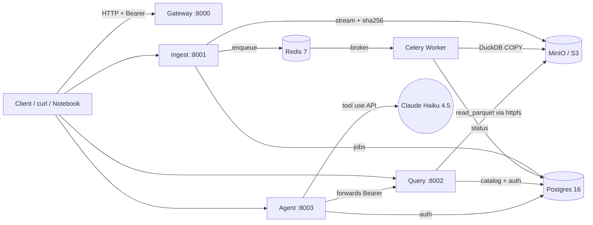

# Pulse &mdash; Agentic Lakehouse Backend

Pulse is a self-hostable backend platform that ingests CSV business data,
normalizes it into a queryable lakehouse on object storage, exposes
operations through versioned REST APIs, and answers natural-language
questions via an LLM agent that calls those APIs as tools. Every claim
the agent makes is traceable to a tool-call result &mdash; grounding is
a structural property of the system, not a prompt convention.

## Architecture



## Demo

A 4-minute walkthrough covering upload &rarr; query &rarr; agent &rarr;
observability. Step-by-step script with copy-pasteable commands lives at
[`docs/demo.md`](docs/demo.md).

## Quickstart

**Windows (PowerShell):**

```powershell
Copy-Item .env.example .env
# (paste an Anthropic API key into .env or leave PULSE_AGENT_PROVIDER=mock)
.\pulse.ps1 up -d
```

**macOS / Linux:**

```bash
cp .env.example .env
./pulse.sh up -d
```

Then:

- **Docs index:** http://localhost:8000/docs (links to each service's Swagger UI)
- **Health:** http://localhost:8001/health (and :8000, :8002, :8003)
- **Metrics:** http://localhost:8001/metrics (Prometheus, same on every port)
- **MinIO console:** http://localhost:9001 (`pulse` / `pulse_dev_password`)

First-run setup: the demo tenant + API key are seeded by the migrations
+ `scripts/seed_demo_tenant.py`. Use `Authorization: Bearer demo-key-1234`
on all protected endpoints.

### Smoke test

```bash
# Upload a CSV (async; returns 202 + job_id immediately)
curl -X POST http://localhost:8001/v1/ingest/upload \
    -H "Authorization: Bearer demo-key-1234" \
    -F "file=@data/olist/olist_geolocation_dataset.csv" \
    -F "dataset=olist_geolocation"

# Ask the agent a question
curl -X POST http://localhost:8003/v1/agent/ask \
    -H "Authorization: Bearer demo-key-1234" \
    -H "Content-Type: application/json" \
    -d '{"question":"Top 3 Brazilian states by geolocation entries?"}'
```

## Features

- **Async ingestion** with idempotency on `(tenant_id, sha256(file))`.
  Endpoint returns 202 in &lt; 1.5 s for 60 MB / 1 M-row uploads; Celery
  worker drives `queued -> processing -> done|failed`.
- **Two query interfaces** &mdash; structured JSON DSL (the agent's
  tool surface) and a `sqlglot`-validated read-only SQL endpoint
  (humans only). Both enforce tenant scope via DuckDB views.
- **LLM agent with 4-tool registry** &mdash; `list_datasets`,
  `describe_dataset`, `run_query`, `get_distinct_values`. Bounded
  tool-use loop (max 8 iterations). Mock provider for offline / CI.
- **Observability built in** &mdash; JSON structured logs with
  correlation IDs (`X-Request-ID` round-trips), Prometheus `/metrics`
  on every service, healthchecks driving `depends_on`.
- **Multi-tenant by design** &mdash; `tenant_id` baked into every table,
  storage path, and API context from day 1. Only the `demo` tenant is
  seeded but adding more is row inserts, not a refactor.

## Project structure

```
pulse/
├── services/
│   ├── gateway/    # FastAPI front door, docs aggregator
│   ├── ingest/     # CSV upload + Celery workers
│   ├── query/      # DSL + safe SQL over DuckDB/Parquet
│   └── agent/      # LLM tool-calling orchestrator
├── shared/         # auth, logging, metrics, middleware, db, storage, config
├── migrations/     # Alembic schema migrations
├── scripts/        # seed_demo_tenant.py
├── infra/
│   └── docker-compose.yml
├── docs/
│   ├── adr/        # Architecture Decision Records (3)
│   ├── benchmark.md
│   └── demo.md
├── tests/          # pytest, including 1 end-to-end test
├── .env.example
├── pulse.ps1       # docker-compose wrapper for Windows
├── pulse.sh        # docker-compose wrapper for macOS / Linux
└── pyproject.toml  # uv-managed
```

## Performance

See [`docs/benchmark.md`](docs/benchmark.md) for full methodology and
numbers. Headline:

- Ingest **~262k rows/sec median** on 99k+-row Olist datasets, **376k rows/sec**
  on the 1 M-row geolocation file. ~75&times; the 5k rows/sec target.
- Query **p50 ~280 ms, p95 ~340 ms** on the 1 M-row Parquet.
- Agent question resolves in ~6 s wall-clock, 4 model turns, ~$0.01
  on Claude Haiku 4.5.

## Documentation

- [`docs/adr/0001-duckdb-parquet.md`](docs/adr/0001-duckdb-parquet.md) &mdash;
  Why DuckDB + Parquet, not ClickHouse / Trino / a hosted warehouse.
- [`docs/adr/0002-celery-redis.md`](docs/adr/0002-celery-redis.md) &mdash;
  Why Celery + Redis, not RQ / Postgres-backed queue.
- [`docs/adr/0003-structured-dsl-and-safe-sql.md`](docs/adr/0003-structured-dsl-and-safe-sql.md) &mdash;
  Why two query interfaces and not just raw SQL.
- [`docs/benchmark.md`](docs/benchmark.md) &mdash; throughput / latency
  with methodology.

## Development

```bash
# install deps locally (for ruff/mypy/pytest editing in your IDE)
uv sync

# lint + type-check
uv run ruff check .
uv run mypy services shared

# tests
uv run pytest

# rebuild one service (Windows)
.\pulse.ps1 up -d --build query

# rebuild one service (macOS / Linux)
./pulse.sh up -d --build query
```

## What was cut from v1, and why

A scope log, in the spirit of shipping a polished v1 over a sprawling v0.5.

- **Live deployment** (Fly.io / Railway). The five-container Compose
  stack is harder to map to free-tier hosts than the polish payoff
  justifies. Documented as a deferral.
- **Cassandra raw-event store.** MongoDB satisfies the NoSQL slot;
  swapping for Cassandra is a non-trivial schema redesign with little
  signal value.
- **Webhook streaming + dead-letter queue.** Interesting, but real
  webhook handlers belong with a real streaming source (Kafka). Out
  of scope.
- **Per-tenant rate limiting at the gateway.** With one seeded tenant
  there's nothing to limit. Implementation noted in
  ADR-0003's "Revisit triggers".
- **MCP server boundary for agent tools.** Direct SDK tool-use was
  simpler and is functionally equivalent for one consumer. Logged
  for next iteration.
- **More than one seeded tenant.** Architecture supports it
  (`tenant_id` everywhere); seeding is a script call away.

## License

MIT.
